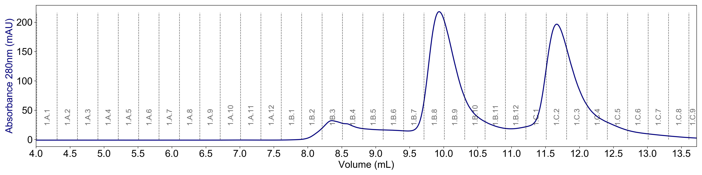
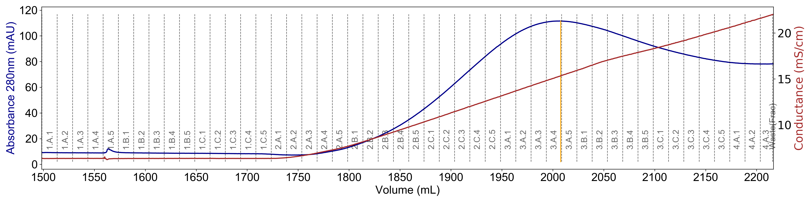
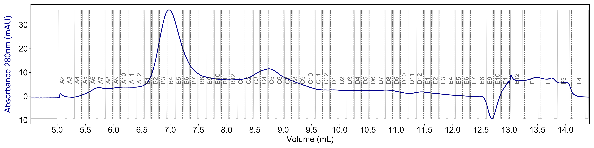

# Plot Akta Results

Use this script to turn your Akta results file from Unicorn (.csv) into a nicely formatted pdf and png. It will plot the UV trace, but additional data can be overlaid (see below).

Usage:

```
plotakta.py [options] filename.csv
```

## Getting Started

* Make sure you have Python 3 installed and have the **numpy** and **matplotlib** packages.

* Export your Akta results file as a .csv file. Avoid spaces in the filename.

## Options

* ```-c``` Overlay the Conductance trace

* ```-b``` Overlay the %B trace

* ```-l``` Overlay the Log (e.g. injection, elution, etc.)

* ```-f``` Overlay the fractions from the Akta fractionator

* ```-t``` Overlay and label the fractions from the CETAC fractionator

* ```-o``` Only plot where fractions were collected (add *-e* if you only want elution fractions)

* ```-e``` Only plot fractions that are marked as part of an elution

* ```-m``` Draw a vertical line at the maximum UV

* ```-h``` Show help message

Options can be combined together without putting a new dash every time (e.g. ***-cbf***)

## Examples

* UV trace only, fractions labeled, zoomed into the elution fractions:

```
python plotakta.py -foe mypurification_results.csv
```



---

* UV trace, conductance trace, %B trace, and log overlaid (for purification overviews):

```
python plotakta.py -cbl mypurification_results.csv
```


---

* UV trace, conductance trace, and fractions labeled, zoomed into the elution fractions, with a line drawn at maximum UV:

```
python plotakta.py -cfoem mypurification_results.csv
```



---

* UV trace only, CETAC fractions labeled, zoomed into the elution fractions:

```
python plotakta.py -toe mypurification_results.csv
```



## How it Works

This is a fairly simple script that reads the columns from the .csv file and identifies columns with specific labels:


| Heading       | Data          		|
| ------------- |---------------------- |
| UV 1_280      | UV trace 				|
| Cond      	| Conductance trace 	|
| Conc B 		| Percent B trace   	|
| Fraction 		| Fraction labels   	|
| Run Log 		| Run Log labels    	|
| Digital in 1 	| CETAC fraction labels |

The data is plotted depending on the options selected in the command line arguments. The script has only been tested for Unicorn 7.0, 7.1, and 7.3 and CETAC 1.3.1.

The CETAC fractions are labeled assuming that true fractions are in between two dips in the signal (also shown for verification). See the last example above.

## Updates

* 2020-02-25 - Version 1.1

* 2020-02-23 - Version 1.0

## License

This project is licensed under the MIT License - see the [LICENSE.md](LICENSE.md) file for details
